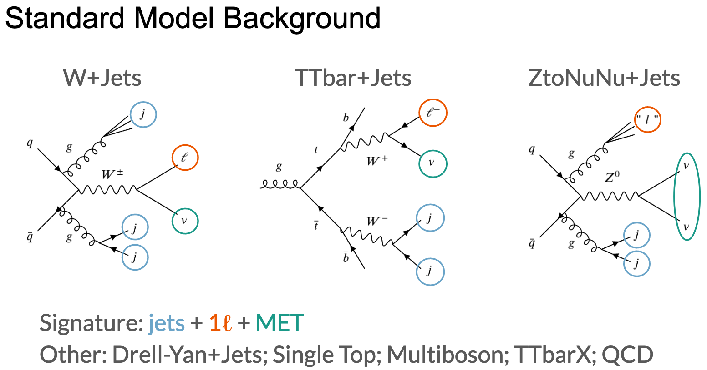
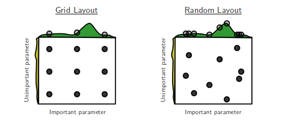

# LIP Summer Internship 2019: Stop 4-body decay with NN approach

In the next 4 weeks you are going to experience a little bit of what an experimental particle physicist does. We are going to focus on the search for stop pair production where each stop decays in four bodies.


We'll be looking in the compressed scenario where: Δm = m(stop)-m(neutralino) < 80 GeV using 2016 samples. Since we don't know the mass of the stop nor the mass of the neutralino our signal will be a Δm (from 10 to 80 GeV) composed of different signal points with the same Δm.



Our background is all the standard model processes that have the same signature as the signal: 1 lepton, jets and missing transverse energy (MET). To separate signal from background you're going to develop a NN classifier.

You'll find everything you need to know on 2016 publication [CMS-SUS-17-005](https://arxiv.org/pdf/1805.05784.pdf)!

By the end of this internship you'll understand a little bit more of experimental particle physics from both a theoretical and a practical point of view. I hope this guide will be useful to you and that you develop your coding skills in python, root, shell scripting and a little bit of C++.

## Setup

These are the steps you need to do before your work as a summer student starts. You should only do it once.

1. Get access with the IT team to lip's ncg machines
2. From your computer, connect to **cassini** via ssh
```sh
ssh -CY <username>@cassini.ncg.ingrid.pt
```
3. Create a symlink to your **lstore** space
```sh
ln -s /lstore/cms/<username> LSTORE
```
4. Create a GitHub account and fork this repository
5. Clone with SSH your repository to your working area and remote add mine
```sh
cd LSTORE
git clone git@github.com:<github_username>/StopNN.git
cd StopNN
git checkout ev19
git remote add dbastos https://github.com/diogodebastos/StopNN.git
git pull dbastos ev19
```
6. Do your first commit
```sh
git add .
git commit -m "my first commit"
git push
```

**ev19** is the branch your are going to use for this summer project.

If you've never worked with GitHub and don't know how to clone a repository [here](https://help.github.com/en/articles/cloning-a-repository) is a helpful guide! You'll also need to generate a new ssh key to do so, follow [this](https://help.github.com/en/articles/generating-a-new-ssh-key-and-adding-it-to-the-ssh-agent).

## Step 0 - Preparing your Data

The first step is to prepare your data for the neural network. You are going to use Monte Carlo (MC) simulated datasets for both signal and background. This MC samples should truthfully represent detector Data.


We can see that the Data/MC agreement is pretty good within 20%. This means we can trust our simulated datasets. The next step is to split our datasets into **train** and **test**. We want to train our NN in one dataset and them test in another to have an unbiased evaluation of a final model. Typically, in Machine Learning we also use a **validation** dataset different from the others to tune the model hyperparameters. In  this exercises the test and validation  datasets are  the same for the sake of simplicity. Since the main focus of your internship is to develop a NN, this step is already done. The samples are located here: `/home/t3cms/dbastos/LSTORE/Stop4Body/` in `nTuples16_v2017-10-19*` directories.

#### Exercise 1 - Inspect your datasets

In this exercise you are going to open the samples you're going to use, understand them and inspect the features of your NN. This means you'll use [root](https://root.cern.ch/) - a data analysis software born at CERN. [Click here for a very useful root guide](https://root.cern.ch/root/htmldoc/guides/primer/ROOTPrimer.html).

1. Load root in your session at **cassini**
```sh
module load root
```
2. Go to the following directory: `/home/t3cms/dbastos/LSTORE/Stop4Body/nTuples16_v2017-10-19_test`
```sh
cd /home/t3cms/dbastos/LSTORE/Stop4Body/nTuples16_v2017-10-19_test
```
3. Open the signal sample m(stop)=550 and m(neutralino)=520
```sh
root -l T2DegStop_550_520.root
```
4. Inspect the content of *bdttree*
```sh
new TBrowser
```
5. Draw the distribution of the leptons momentum - **LepPt**
```sh
TH1D* t = new TH1D("t", "lepPT", 200,0,200)
bdttree->Draw("LepPt>>t")
```
6. Repeat these steps for the following variables: XS, Jet1Pt, Met, mt, LepEta, LepChg, HT, NbLoose, Njet, JetHBpt, DrJetHBLep and JetHBCSV

7. Repeat the same steps for other signal samples, for **T2DegStop_deltaM30.root** and for background samples: WJets, TTbar, ZInv

Tip: For the last 2 steps, writing a script that does this work for you and then plots the variables might help you! You can use these [scripts as inspiration](https://github.com/diogodebastos/Stop4Body/tree/master/Macros/pMacros). This type of scripts that runs on root are called **Macros**:
[working with macros](https://root.cern.ch/working-macros).

## Step 1 - Training a Neural Network

Reading: [Gile's blog post on understanding neural networks](https://amva4newphysics.wordpress.com/2017/03/21/understanding-neural-networks-part-i/?fbclid=IwAR0EhuO-2EzGVDd8ZS9P-SLYLWZvIucRM0ovxVdJYGhIBdC82rI3ImnTmWY)

For the application of the neural network we will be using the [Keras framework](https://keras.io). We will be running it with the [TensorFlow](https://www.tensorflow.org) backend.

Before going into the implementation of your neural network we should start by covering some concepts:
- **activation function:** defines the output of a neuron. Historically, sigmoid was the most used one but nowadays ReLU is a good place to start. Functions that use the exponential are heavier to compute - ex: ReLU, ELU, softmax, sigmoid
- **[loss function](https://towardsdatascience.com/understanding-binary-cross-entropy-log-loss-a-visual-explanation-a3ac6025181a):** the function you want to minimize during training. It's a measurement of your model's prediction vs the true label. For a binary classification you can use binary cross entropy. To this loss function it's good if you balance it with weight regularization.
- **gradient-descent algorithm:** the method applied to minimize the loss function and find a local minimum.
- **learning rate:** the step you use to update your weights. Common values for learning rates are: 1e-3..1e-5. Start with a high learning rate and decay it over epochs.
- **regularizers:** you want your weights to be spread out. Relative very big weights might make the other neurons obsolete and you lose discrimination power. One technique is to regularize them. Check L1, L2 regularization methods. You can also implement dropout layers. In a way, dropout gives redundancy to your networks and you can see it as having an ensemble of networks sharing features.
- **optimization:** you can use different methods to optimize your network: stochastic gradient descent, momentum, Nesterov accelerated gradient, AdaGrad, RMSProp, Adam... Adam is a good one to start
- **backpropagation:** you want to check how each feature has an impact on the final output.  
- **weight initialization:** Be careful, don't initialize your weights to zero, small random numbers might be ok for small networks. A reasonable strategy, have unit gaussian data as input and  variance of 1 - ex: Glorot good for tanh activation function doesn't work very well for ReLU activation function use He Normal instead. **You can also do [batch normalization](https://www.dlology.com/blog/one-simple-trick-to-train-keras-model-faster-with-batch-normalization/).**

We'll go through all of them on the white board: design a neuron, feedforward the information and then back propagate.

Now that your datasets are ready and you are familiar with the main variables it's time to build your machine learning model. To do this, you should use the `trainNN.py` script.

#### Exercise 2 - Build your first NN model for classification

For this exercise, I eagerly advise you to have a look into [this tutorial](https://machinelearningmastery.com/tutorial-first-neural-network-python-keras/).

1. Build a NN with:
 - Input layer: 12 neurons
 - 1 Hidden layer: 14 neurons
 - Output layer: 1 neuron
 - Epochs: 100
 - Batch size: 3000
 - Learning rate: 0.001
 - Use **relu** activation function for input and hidden layers and **sigmoid** for the output layer
 - Kernel initializer: **he_normal** for input and hidden layers and **glorot_normal** for the output layer
2. Plot accuracy and loss evolution over epochs for both training and validation datasets. What can you tell about your model?
3. Port your model to the `commonFunctions.py` script as a function, call it `ev19Classifier` and use it in `trainNN.py`. Something like:
```sh
model = ev19Classifier(...)
```

#### Exercise 3 - Improve your NN

1. Improve your model. Here you can play with every parameter of the first step of the precious exercise. You should do some reading to understand how and what you can do to **optimize** your model
2. Build **3** more models (as functions in `commonFunctions.py`). Use dropout layers in at least one of those models. You can also have a look into:
  - Callbacks
  - Early stopping
3. What was the best model you could come up with?

Tip: to improve the speed of your training you should use lip's batch system and submit your training as a job. To do this, you can use/edit the `trainNN.sh` script. To submit it, do the following:
```sh
qsub trainNN.sh
```

## Step 2 - Evaluating your classifier

Remember that you saved your model as an .h5 file. Now, you are going to load it, apply it and "plot" it.

#### Exercise 4 - "Plot" your NN

Your life is facilitaded in this exercise. You just have to look into `plotNN.py` script and run it over your trained model.

1. Run `plotNN.py` over your model
2. Look at each one of the produced plots. Take a special look into the `ROC` curve and the `FOM` plots. What can you infer from them?

## Step 3 - Hyperparameter Optimization

As we’ve seen, training Neural Networks can involve many hyperparameter settings. The most common hyperparameters in context of Neural Networks include:
- the initial learning rate
- learning rate decay schedule (such as the decay constant)
- regularization strength (L2 penalty, dropout strength)

But you should also play with the network architecture!

There are many ways to optimize your hyperparameters. We are going to cover **random search** and **bayesian optimization**.

#### Random Search vs Grid Search

Imagine you are in the hyperparameter space, that you have all combinations possible of hyperparameters, some of those combinations will give you the best performing neural network for your problem. Unfortunately, computing this is impossible since I just described an infinite space. This means that we can discretize this space and start by choosing only some points, some combinations of hyperparameters, evaluate our models and choose the best one. The way we choose this points can be random or we can select some points equally distant from their closest neighbour. Turns out that it's actually better to sample randomly!



#### Exercise 5 - Optimize your NN: Random Search

You are going to implement a random search!

1. Create a script that takes advantage of `trainNN.py` to build neural networks
2. Submits them to the batch system
3. Evaluates them
4. Optimize over **learning rate**, **weight regularization parameter** and network **topology** (number of neurons and layers)
5. What is your best set of hyperparameters?

Tip: Optimize in log space: `lr = 10**uniform(-3,-6); reg = 10**uniform(-5,5)`

#### Bayesian optimization
_To be finished..._

----
Good reads:
- [Understanding learning rates](https://towardsdatascience.com/understanding-learning-rates-and-how-it-improves-performance-in-deep-learning-d0d4059c1c10)
- [ML cheatsheet](https://ml-cheatsheet.readthedocs.io/en/latest/index.html)
- [Visual Information Theory](http://colah.github.io/posts/2015-09-Visual-Information/O)
- [Andrej Karpathy's lectures](https://www.youtube.com/watch?v=8inugqHkfvE&list=PLkt2uSq6rBVctENoVBg1TpCC7OQi31AlC&index=2) + [CS231n course](http://cs231n.github.io/)

Good demos:
- [TensorFlow Neural Network Playground](https://playground.tensorflow.org)
- [ConvnetJS demo: toy 2d classification](https://cs.stanford.edu/people/karpathy/convnetjs//demo/classify2d.html)
----
**TO DO:**
- more examples
- **Preprocess data:** zero-center, normalize (by standard deviation), PCA, whitening
